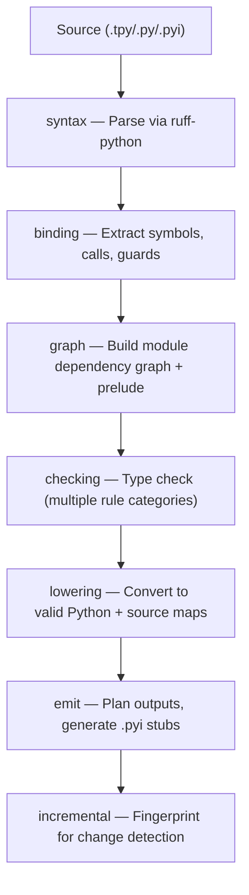

# TypePython

**A statically-typed authoring language that compiles to standard Python.**

TypePython adds a powerful type system and ergonomic syntax extensions to Python. You write `.tpy` files with features like `interface`, `data class`, `sealed class`, and inline generics -- the compiler emits clean `.py` and `.pyi` files that run on any standard Python interpreter.

> No custom interpreter. Just safer Python.

---

## Highlights

- **Compiles to Python** -- `.tpy` source emits standard `.py` + `.pyi` stubs; runs on CPython 3.10+
- **Rich type system** -- `unknown`, `dynamic`, `Never`, strict nulls, sealed exhaustiveness, TypedDict utilities, generic defaults
- **Syntax sugar** -- `interface`, `data class`, `sealed class`, `overload def`, `typealias`, `unsafe:` blocks, inline type parameters
- **Fast Rust core** -- 11-crate Rust workspace with incremental builds, thin LTO, and single-codegen-unit release profile
- **Full toolchain** -- CLI (`init` / `check` / `build` / `watch` / `clean` / `verify` / `migrate`), LSP server, and JSON diagnostics
- **Bundled stdlib stubs** -- bundled typing data covering the Python 3.10-3.12 standard library
- **Incremental** -- fingerprint-based caching; only rechecks modules whose public API changed
- **Publication-ready** -- `typepython verify` validates wheel/sdist consistency and public API completeness

## Quick Start

### Prerequisites

- **Rust** 1.94.0 (the pinned development/CI toolchain; workspace MSRV is 1.85)
- **Python** 3.9+ (for the Python package bridge; emitted projects target Python 3.10, 3.11, or 3.12)

### Install from source

```bash
# Clone the repository
git clone https://github.com/type-python/type-python.git
cd type-python

# Bootstrap the Rust toolchain
./scripts/bootstrap-rust.sh

# Run CI checks (format, lint, test)
make ci
```

### Create a new project

```bash
# Initialize a TypePython project
cargo run -p typepython-cli -- init --dir my-project
cd my-project
```

This creates:

```
my-project/
  typepython.toml        # Project configuration
  src/
    app/
      __init__.tpy       # Starter source file
```

### Write your first `.tpy` file

```python
# src/app/__init__.tpy

data class User:
    name: str
    age: int
    email: str | None = None

interface Greetable:
    def greet(self) -> str: ...

def welcome(user: User) -> str:
    return f"Hello, {user.name}! You are {user.age} years old."
```

### Check and build

```bash
# Type-check only (no output files)
cargo run -p typepython-cli -- check --project .

# Full build: emit .py + .pyi into .typepython/build/
cargo run -p typepython-cli -- build --project .

# Watch mode: rebuild on file changes
cargo run -p typepython-cli -- watch --project .
```

### Install as a Python package

```bash
pip install -e .

# Now you can run:
typepython check --project my-project
typepython build --project my-project
python -m typepython check --project my-project
```

## By Example

### Data classes

```python
data class User:
    name: str
    email: str
    age: int = 0
```

Compiles to `@dataclass class User:` with all fields preserved.

### Interfaces (structural protocols)

```python
interface Serializable:
    def to_json(self) -> str: ...
```

Any class with a `to_json() -> str` method satisfies `Serializable` -- no inheritance needed. Compiles to `class Serializable(Protocol):`.

### Sealed classes and exhaustive matching

```python
sealed class Expr:
    pass

class Num(Expr):
    value: int

class Add(Expr):
    left: Expr
    right: Expr

def evaluate(expr: Expr) -> int:
    match expr:
        case Num(value=v):
            return v
        case Add(left=l, right=r):
            return evaluate(l) + evaluate(r)
    # Compiler proves all cases are covered -- no default needed.
```

### Generics with inline type parameters

```python
def first[T](items: list[T]) -> T:
    return items[0]

class Stack[T]:
    def push(self, item: T) -> None: ...
    def pop(self) -> T: ...
```

### Overloaded functions

```python
overload def parse(value: str) -> int: ...
overload def parse(value: bytes) -> int: ...

def parse(value: str | bytes) -> int:
    if isinstance(value, str):
        return int(value)
    return int(value.decode())
```

### Type aliases (including recursive)

```python
typealias JsonPrimitive = str | int | float | bool | None
typealias JsonValue = dict[str, "JsonValue"] | list["JsonValue"] | JsonPrimitive
```

### Strict null safety

```python
def find(users: list[User], name: str) -> User | None:
    for u in users:
        if u.name == name:
            return u
    return None

def greet(users: list[User], name: str) -> str:
    user = find(users, name)
    # user is User | None here -- cannot access .email directly
    if user is None:
        return "unknown"
    # user is narrowed to User here
    return f"Hello, {user.email}"
```

### Unsafe blocks

```python
def eval_expression(expr: str) -> object:
    unsafe:
        return eval(expr)
    # eval() outside unsafe: produces a TPY4019 warning
```

### TypedDict utilities

```python
class Config(TypedDict):
    debug: bool
    timeout: int
    name: str

typealias OptionalConfig = Partial[Config]
typealias CoreConfig = Pick[Config, "debug", "timeout"]
typealias PublicConfig = Omit[Config, "debug"]
```

### More examples

| Example                                              | Features demonstrated                                                           |
| ---------------------------------------------------- | ------------------------------------------------------------------------------- |
| [`examples/hello-world/`](examples/hello-world/)     | Minimal starter project                                                         |
| [`examples/todo-app/`](examples/todo-app/)           | `data class`, `TypedDict`, `overload`, enum, null narrowing, union narrowing    |
| [`examples/shapes/`](examples/shapes/)               | `sealed class`, exhaustive `match`, `interface`, `data class`, generic function |
| [`examples/http-client/`](examples/http-client/)     | `interface`, generic class with bound, `overload`, `TypedDict`, null safety     |
| [`examples/config-loader/`](examples/config-loader/) | `unknown` type, `isinstance` narrowing, `assert` narrowing, `unsafe` blocks     |
| [`examples/event-system/`](examples/event-system/)   | `sealed class` + `data class` + `interface` + generics + exhaustive `match`     |
| [`examples/showcase/`](examples/showcase/)           | All features combined in a multi-file project                                   |

## What TypePython Compiles To

| TypePython (`.tpy`)               | Python (`.py`)                                      |
| --------------------------------- | --------------------------------------------------- |
| `data class User:`                | `@dataclass` + `class User:`                        |
| `interface Drawable:`             | `class Drawable(Protocol):`                         |
| `sealed class Expr:`              | `class Expr:  # tpy:sealed`                         |
| `overload def f(x: int) -> int:`  | `@overload def f(x: int) -> int:`                   |
| `typealias Pair[T] = tuple[T, T]` | `T = TypeVar("T")`; `Pair: TypeAlias = tuple[T, T]` |
| `def first[T](xs: list[T]) -> T:` | `T = TypeVar("T")`; `def first(xs: list[T]) -> T:`  |
| `unsafe: ...`                     | wrapped in an `if True:` block                      |

TypePython currently lowers to compatibility-oriented Python across supported targets. It does not emit Python 3.12 native `type` statements or `def f[T](...)` syntax.

## Architecture

TypePython is built as a modular Rust workspace with 11 crates forming a multi-phase compilation pipeline:



### Crate Map

| Crate                    | Purpose                                                         |
| ------------------------ | --------------------------------------------------------------- |
| `typepython_cli`         | User-facing binary, command routing                             |
| `typepython_config`      | Project discovery, `typepython.toml` / `pyproject.toml` loading |
| `typepython_diagnostics` | Shared diagnostic model (errors, warnings, notes)               |
| `typepython_syntax`      | Source parsing via ruff-python AST                              |
| `typepython_binding`     | Symbol extraction, declaration and call-site collection         |
| `typepython_graph`       | Module graph construction, prelude injection                    |
| `typepython_checking`    | Type checking rules and diagnostic generation                   |
| `typepython_lowering`    | TypePython-to-Python lowering with source maps                  |
| `typepython_emit`        | Output planning, stub generation, runtime validators            |
| `typepython_incremental` | Fingerprint-based incremental build state                       |
| `typepython_lsp`         | Language Server Protocol implementation                         |

See [docs/architecture.md](docs/architecture.md) for the full dependency graph and detailed crate breakdown.

## CLI Commands

| Command              | Description                                         |
| -------------------- | --------------------------------------------------- |
| `typepython init`    | Create a new project with starter config and source |
| `typepython check`   | Type-check without emitting output                  |
| `typepython build`   | Full build: emit `.py`, `.pyi`, and cache           |
| `typepython watch`   | Incremental rebuild on file changes                 |
| `typepython clean`   | Remove build and cache directories                  |
| `typepython lsp`     | Start the Language Server (stdio JSON-RPC)          |
| `typepython verify`  | Validate build artifacts for publication            |
| `typepython migrate` | Analyze and assist migration from Python            |

All commands support `--format text|json` for output formatting. See [docs/cli-reference.md](docs/cli-reference.md) for full details.

## Configuration

TypePython projects are configured via `typepython.toml` (or `[tool.typepython]` in `pyproject.toml`):

```toml
[project]
src = ["src"]
target_python = "3.10"
out_dir = ".typepython/build"

[typing]
profile = "application"      # "library" | "application" | "migration"
strict = true
strict_nulls = true

[emit]
emit_pyi = true
no_emit_on_error = true
```

Three built-in **profiles** configure sensible defaults:

| Profile       | Use Case           | Key Defaults                              |
| ------------- | ------------------ | ----------------------------------------- |
| `library`     | Published packages | `strict`, `require_known_public_types`    |
| `application` | Applications       | `strict`, relaxed public API requirements |
| `migration`   | Gradual adoption   | Lenient, `imports = "dynamic"`            |

See [docs/configuration.md](docs/configuration.md) for the complete reference.

## Type System

TypePython's type system extends Python typing with safety-focused additions:

- **`unknown`** -- safe top type; must be narrowed before use (unlike `Any`)
- **`dynamic`** -- escape hatch equivalent to `Any`; explicit opt-in
- **`Never`** -- bottom type for unreachable code
- **Strict nulls** -- `None` excluded from `T` unless `T | None` is explicit
- **Interfaces** -- structural protocols via `interface` keyword
- **Sealed classes** -- exhaustiveness checking in `match` statements
- **TypedDict utilities** -- `Partial`, `Required_`, `Readonly`, `Mutable`, `Pick`, `Omit`
- **Generic defaults** -- `T = int` type parameter defaults
- **Type narrowing** -- `is None`, `isinstance`, `TypeGuard`, `TypeIs`, `assert`, `match`

See [docs/type-system.md](docs/type-system.md) and [docs/syntax-guide.md](docs/syntax-guide.md) for full coverage.

## Diagnostics

TypePython emits structured diagnostics with unique error codes:

| Range     | Category                        |
| --------- | ------------------------------- |
| `TPY1xxx` | Configuration and project       |
| `TPY2xxx` | Parsing and lowering            |
| `TPY3xxx` | Import and module resolution    |
| `TPY4xxx` | Type checking and flow analysis |
| `TPY5xxx` | Emit and stub generation        |
| `TPY6xxx` | LSP and infrastructure          |

Diagnostics include machine-readable **suggestions** with fix spans, making them suitable for editor quick-fix actions. See [docs/diagnostics.md](docs/diagnostics.md) for the full code reference.

## Editor Support

TypePython ships with a built-in LSP server supporting:

- Hover (type information)
- Go to Definition
- Find References
- Rename Symbol
- Code Actions (quick fixes)
- Completions (triggered on `.`)
- Real-time diagnostics

```bash
typepython lsp --project .
```

See [docs/lsp.md](docs/lsp.md) for editor setup instructions.

## Project Structure

```
type-python/
  Cargo.toml              # Rust workspace root
  Cargo.lock
  pyproject.toml           # Python package metadata
  setup.py                 # Build bridge (compiles Rust, bundles binary)
  typepython.toml          # Template config
  rust-toolchain.toml      # Pinned Rust 1.94.0
  Makefile                 # Dev targets: fmt, lint, test, ci
  crates/
    typepython_cli/        # CLI binary
    typepython_config/     # Configuration loading
    typepython_diagnostics/# Diagnostic model
    typepython_syntax/     # Parser boundary
    typepython_binding/    # Symbol binding
    typepython_graph/      # Module graph
    typepython_checking/   # Type checker
    typepython_lowering/   # Python lowering
    typepython_emit/       # Output generation
    typepython_incremental/# Incremental state
    typepython_lsp/        # Language server
  stdlib/                  # Bundled stdlib/type stub snapshot
  typepython/              # Python package bridge
  templates/               # Project init templates
  examples/
    hello-world/           # Minimal starter project
    showcase/              # Multi-file feature showcase
    todo-app/              # data class, TypedDict, overload, null safety
    shapes/                # sealed class, exhaustive match, interface
    http-client/           # interface, generics, overload, TypedDict
    config-loader/         # unknown, narrowing, unsafe blocks
    event-system/          # sealed + interface + generics + match
  docs/                    # Documentation
  scripts/
    bootstrap-rust.sh      # Rust toolchain setup
  .github/
    workflows/
      rust.yml             # CI: format, lint, test
```

## Documentation

| Document                                                                        | Description                                                         |
| ------------------------------------------------------------------------------- | ------------------------------------------------------------------- |
| [Architecture](docs/architecture.md)                                            | Crate map, pipeline, dependency graph                               |
| [Getting Started](docs/getting-started.md)                                      | Installation and first project walkthrough                          |
| [Configuration Reference](docs/configuration.md)                                | Complete `typepython.toml` options                                  |
| [CLI Reference](docs/cli-reference.md)                                          | All commands, flags, and output formats                             |
| [Type System](docs/type-system.md)                                              | Types, assignability, subtyping, narrowing                          |
| [Interoperability](docs/interop.md)                                             | `.pyi` compatibility with mypy/pyright, semantic boundaries         |
| [Syntax Guide](docs/syntax-guide.md)                                            | TypePython syntax extensions                                        |
| [Diagnostics Reference](docs/diagnostics.md)                                    | All TPYxxxx error codes                                             |
| [LSP Integration](docs/lsp.md)                                                  | Editor setup and capabilities                                       |
| [Migration Guide](docs/migration-guide.md)                                      | Adopting TypePython in existing projects                            |
| [Contributing](docs/contributing.md)                                            | Development setup and PR workflow                                   |
| [FAQ](docs/faq.md)                                                              | Frequently asked questions                                          |
| [Language Specification](docs/spec/language-spec-v1.md)                         | Normative language semantics and typing rules                       |
| [Artifact and Tooling Specification](docs/spec/artifact-and-tooling-spec-v1.md) | Project model, lowering, diagnostics, cache, CLI, and LSP contracts |
| [Conformance and Test Plan](docs/spec/conformance-and-test-plan-v1.md)          | Feature tiers, conformance claims, and required test coverage       |
| [Implementation Notes](docs/spec/implementation-notes-v1.md)                    | Informative rollout, architecture, and security notes               |

## Development

```bash
# Format all Rust code
make fmt

# Lint with clippy
make lint

# Run all tests
make test

# Full CI pipeline (format + lint + test)
make ci

# Generate rustdoc
make docs
```

## License

[MIT](LICENSE) -- Copyright (c) 2026 type-python
